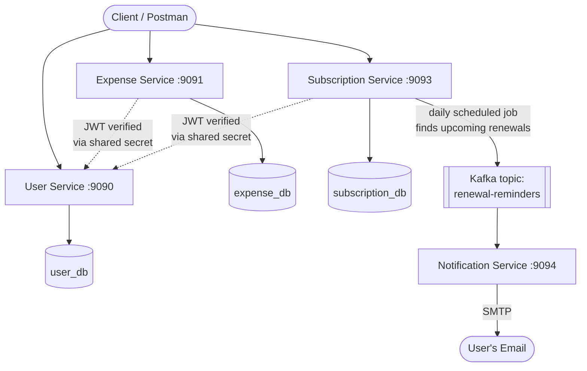

# Smart Expense & Subscription Tracker

A microservices-based backend system that helps users track daily expenses and recurring subscriptions, with automatic email reminders before a subscription renews — built to solve a genuinely common problem: forgetting about a subscription until it silently charges you again.

Built solo, end-to-end, as a hands-on way to move from monolithic Spring Boot development into microservices, event-driven architecture, and containerized deployment.

---

## Problem it solves

- Users lose track of recurring subscriptions (streaming, SaaS tools, gym memberships) and get charged without noticing.
- Daily expenses pile up with no easy category-wise view of where money is going.

This system lets a user register, log in, track expenses, add subscriptions, and automatically receive an email reminder a few days before a subscription renews — without any manual checking.

---

## Architecture

Four independent Spring Boot microservices, each with its own database, communicating over REST and Kafka:



**Why separate databases per service:** each microservice owns its data exclusively — no service reaches into another's database directly. This is a core microservices principle that keeps services independently deployable and loosely coupled.

**Why Kafka instead of a direct REST call for reminders:** Subscription Service's scheduler shouldn't have to know or care whether Notification Service is up, slow, or restarting. It publishes a message to a Kafka topic and moves on. Notification Service consumes it whenever it's ready. If Notification Service is briefly down, no reminders are lost — they're picked up once it's back.

---

## Services

| Service | Port | Responsibility |
|---|---|---|
| **User Service** | 9090 | Registration, login, JWT issuing, password hashing (BCrypt) |
| **Expense Service** | 9091 | CRUD for expenses, JWT-protected |
| **Subscription Service** | 9093 | CRUD for subscriptions, daily scheduled job that detects upcoming renewals and publishes to Kafka |
| **Notification Service** | 9094 | Kafka consumer, sends renewal reminder emails via SMTP |

---

## Tech stack

- **Language / Framework:** Java 21, Spring Boot, Spring MVC, Spring Data JPA, Hibernate
- **Security:** Spring Security, JWT (JJWT), BCrypt password hashing
- **Database:** PostgreSQL (one database per service, single Postgres instance in Compose with an init script)
- **Messaging:** Apache Kafka (KRaft mode, no Zookeeper), Spring Kafka
- **Email:** JavaMailSender (SMTP)
- **Testing:** JUnit 5, Mockito
- **Containerization:** Docker, Docker Compose (multi-service, multi-network orchestration)
- **Build tool:** Maven
- **Version control:** Git / GitHub

---

## Key implementation details worth noting

- **Stateless JWT authentication** — a custom `JwtAuthFilter` (extending `OncePerRequestFilter`) validates the token on every request and sets Spring Security's context; the filter never blocks a request itself, it only sets authentication — the actual authorization decision is left to `SecurityConfig`'s `anyRequest().authenticated()`.
- **Shared JWT secret across services** — Expense and Subscription Service never issue tokens; they only verify tokens issued by User Service, using the same signing secret, so no direct service-to-service auth call is needed on every request.
- **Global exception handling** in every service (`@RestControllerAdvice`) — validation errors, duplicate-resource conflicts, and not-found cases all return clean, consistent JSON instead of raw stack traces.
- **Scheduled job** (`@Scheduled`, cron-based) in Subscription Service checks daily for subscriptions renewing within 3 days.
- **Multi-database Postgres setup** — a single Postgres container serves three separate databases via a custom init script (`init-multiple-dbs.sh`), since each service owns its own schema.
- **Dual Kafka listeners** — configured with separate `PLAINTEXT` (host-machine access) and `INTERNAL` (container-to-container) listeners, since containers can't reach each other via `localhost`.

---

## Running it locally

Requires Docker and Docker Compose installed.

1. Clone the repo:
   ```bash
   git clone https://github.com/tirth-c-21/<repo-name>.git
   cd <repo-name>
   ```

2. Create a `.env` file in the project root (never committed — see `.gitignore`):
   ```env
   JWT_SECRET=your_secret_key_at_least_32_characters_long
   JWT_EXPIRATION=86400000
   DB_PASSWORD=your_postgres_password
   MAIL_USERNAME=your_email@gmail.com
   MAIL_PASSWORD=your_gmail_app_password
   ```

3. Start everything:
   ```bash
   docker compose up -d
   ```

4. Check all containers are healthy:
   ```bash
   docker compose ps
   ```

Services will be available at `localhost:9090` through `localhost:9094`, with Kafka at `localhost:9092` and Postgres at `localhost:5433`.

---

## Testing

Each service includes JUnit 5 + Mockito unit tests covering:
- Service-layer success and failure paths
- JWT generation, validation, and tampering detection
- Not-found and validation exception handling

A full Postman collection covering registration, login, JWT-protected CRUD, and negative test cases (invalid data, duplicate resources, missing/expired/tampered tokens) was used to verify every endpoint across all four services.

---

## Deployment status

This project is fully containerized and runs end-to-end with a single `docker compose up` command — all four services, Kafka, and Postgres start, network correctly, and the complete flow (subscription renewal → Kafka → email) works locally.

**Cloud deployment (AWS EC2) was scoped out** after evaluating that running Kafka, Postgres, and four separate Spring Boot services simultaneously exceeds what a free-tier instance (1 GB RAM) can comfortably handle without a paid upgrade. Rather than deploy a degraded or partially-running demo, the project is documented and demonstrated locally via Docker Compose. Deploying to a right-sized cloud instance (or trimming the stack for a lighter cloud demo) is a natural next step.

---

## Possible next steps

- API Gateway (Spring Cloud Gateway) as a single entry point for all services
- Redis caching for frequently accessed subscription data
- CI/CD pipeline (GitHub Actions) for automated build and deploy
- React frontend for expense/subscription dashboards
- Refresh tokens and token blacklisting for JWT
- Deduplication logic so a renewal reminder isn't sent repeatedly for the same event

---

## Author

**Tirthendu Chakraborty**
Java Backend Developer
[LinkedIn](https://linkedin.com/in/tirthendu-chakraborty) · [LeetCode](https://leetcode.com/u/tirthendu/)
